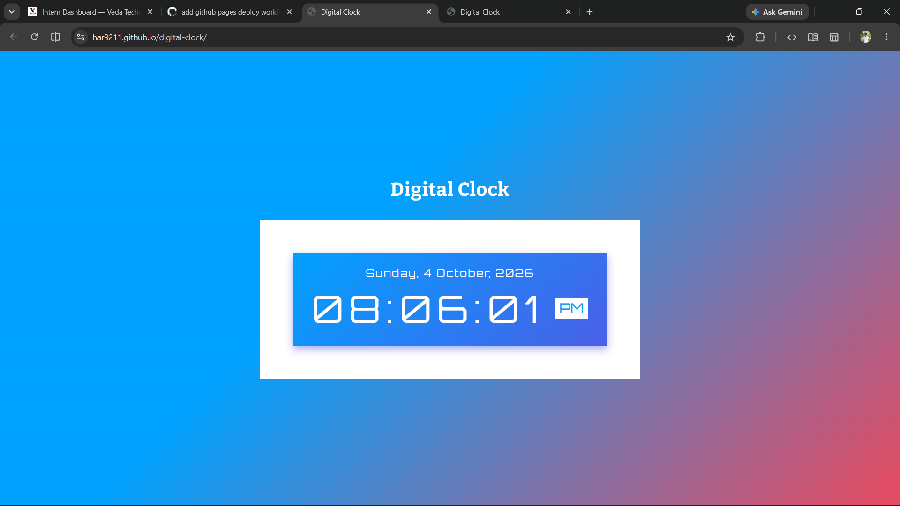
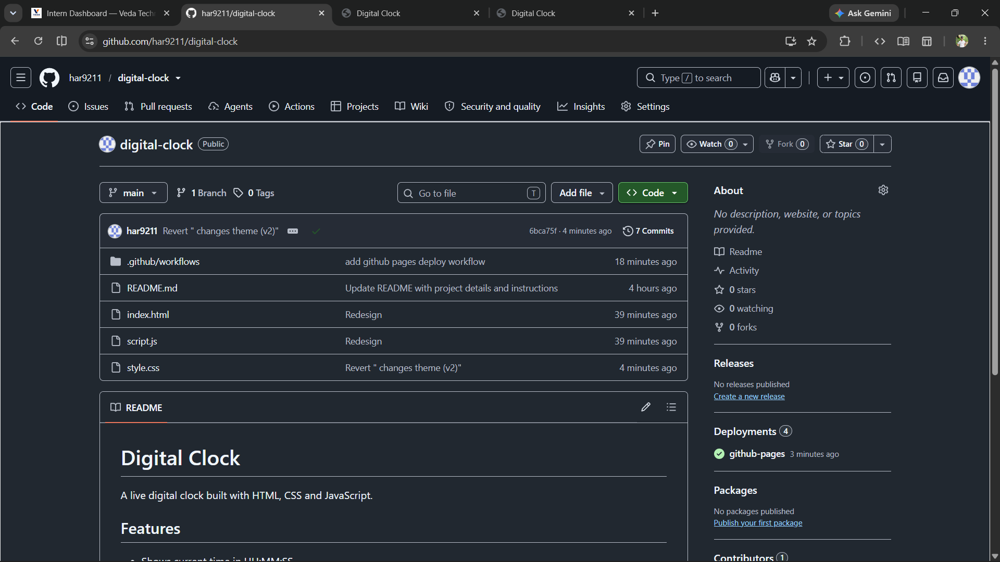
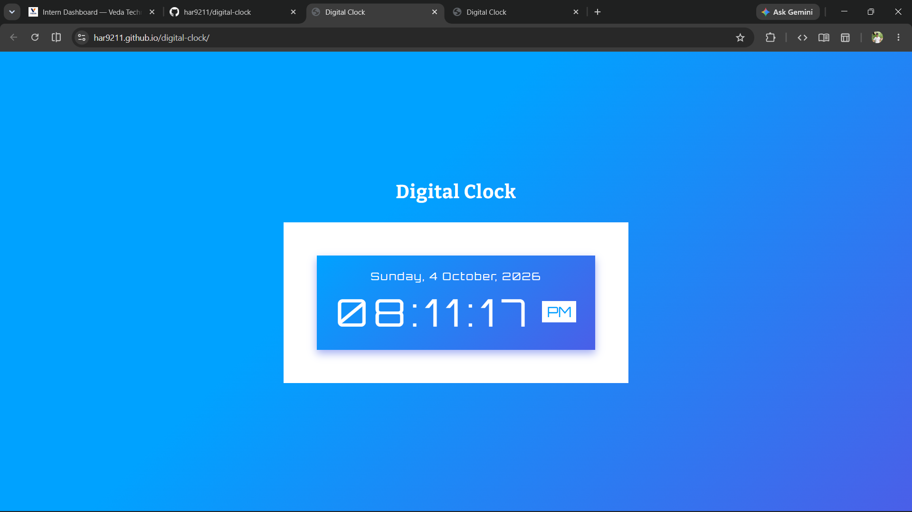

# Digital Clock

A live digital clock built with HTML, CSS and JavaScript.

🔗 **Live Demo:** https://har9211.github.io/digital-clock/

## Objective
Practice JavaScript Date objects, timers, DOM selection and DOM updates.

## Features
- Shows date and time in 12-hour format with AM/PM
- Updates automatically every second
- Responsive layout using CSS `clamp()`

## Approach
1. Selected the date, time and AM/PM elements using `getElementById`.
2. Used `new Date()` inside `updateClock()` to read the current system time.
3. Converted 24-hour time to 12-hour using `hours % 12 || 12`.
4. Added leading zeros with `String(n).padStart(2, "0")`.
5. Used `setInterval(updateClock, 1000)` to refresh every second, and called `updateClock()` once on load to avoid a 1-second blank.
6. Read time from `Date` on every tick instead of incrementing a counter, so the clock never drifts.

## Outcome
A working clock that stays accurate and scales across mobile and desktop screens.

## Tech Stack
HTML5, CSS3, JavaScript

## Deployment
Hosted on GitHub Pages using GitHub Actions (`.github/workflows/deploy.yml`).
Every push to `main` triggers an automatic deploy.

## Rollback Evidence
1. Deployed a visible change (theme color v2).
2. Reverted it using `git revert <hash>` and pushed.
3. The site returned to the previous version automatically.

**Change deployed:**

**Revert commit in history:**

**Site after rollback:**

## Run Locally
Open `index.html` in any browser.
